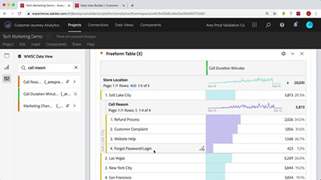

# Customer Journey Analytics 튜토리얼

[!DNL Customer Journey Analytics] 튜토리얼 사이트에 오신 것을 환영합니다. [설명서](https://experienceleague.adobe.com/docs/analytics-platform/using/cja-landing.html?lang=ko-KR)와 함께 이 튜토리얼을 사용하면 Adobe Analytics를 사용하여 고객의 인사이트를 그 어느 때보다 빠르게 얻을 수 있는 방법을 더 잘 이해할 수 있습니다. 시작하려면:

* 최신 제품에 대한 자세한 내용은 아래의 **“새로운 기능”** 섹션을 참조하십시오.
* **직원 추천**&#x200B;은 당사가 가장 좋아하는 콘텐츠 중 일부를 강조 표시합니다.
* **왼쪽 내비게이션**&#x200B;에서 주제 및 하위 항목별로 내용 탐색
* 찾고 있는 것을 알고 있는 경우에는 페이지 상단에 있는 **검색** 필드를 사용하십시오.

Customer Journey Analytics를 사용하면 Analysis Workspace에서 임의 일반 고객 ID의 온라인과 오프라인 데이터를 연결하는 방법을 제어할 수 있으며, 이를 통해 전체 고객 데이터 세트에서 최종적으로 속성, 세분화, 흐름, 폴아웃 등을 수행할 수 있습니다.

## 직원 추천

<table>
<tr>
  <td>
    
    

      <a href="visitor-id/understanding-how-customer-journey-analytics-uses-identity.md">
    <strong>Customer Journey Analytics에서 ID를 사용하는 방법 이해</strong>
    </a>
    

    

    <em>Customer Journey Analytics에서 ID가 분석에 미치는 영향에 대해 실질적으로 살펴보기</em>
    

  </td>
   <td>
    
    

      <a href="architecture/architecture-and-integrations-of-cja.md">
    <strong>Customer Journey Analytics의 아키텍처 및 통합</strong>
    </a>
    

    

    <em>Customer Journey Analytics의 아키텍처(Adobe Experience Platform과의 통합 포함)에 대해 살펴봅니다.</em>
    

  </td>
  <td>
    
    

      <a href="analysis-workspace/visualizations/cross-channel-attribution-in-customer-journey-analytics.md">
    <strong>Customer Journey Analytics의 크로스 채널 속성</strong>
    </a>
    

    

    <em>시각화를 사용하여 채널에서 속성을 표시(크레딧 제공)하는 방법.</em>
    

  </td>
</tr>
</table>

